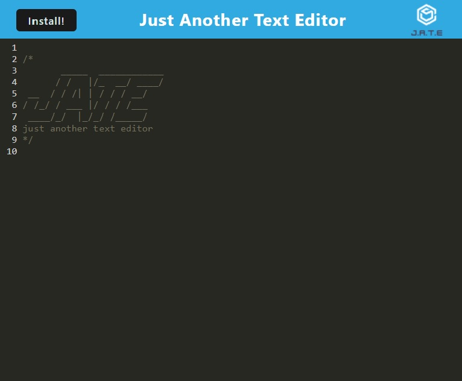

# On-the-Go-Coder

## Description

This is a simple web application that allows clients to code on their browser and have their text automatically saved and reloaded when they leave the page. In addition, this application also allows installation on devices so that users can utilize the text editor offline. 

## [Try it yourself!](https://github.com/MaestroLuu/StoreFront-BackEnd.git)

  

## Installation

To utilize this web application, users will need to have NodeJS installed for functionality of the required npm packages. In addition, the following npm packages listed below in the technology section will also need to be installed(the package.json files within the root, client, and server directories have already been preset to install all necessary packages on the command "npm install" within the terminal). The links to the packages have been provided for further documentation on each package utility. 

## Usage

After completion, users can simply open their browser to their [localhost:3000](http://localhost:3000/) and begin typing in their code. If they wish, they may also install the application onto their personal device for offline utility.

## Technology

- [NodeJS](https://nodejs.org/en/) 
- [IDB](https://www.npmjs.com/package/idb) 
- [Express](https://expressjs.com/) 
- [Babel](https://babeljs.io/) 
- [Webpack](https://webpack.js.org/) 
- [Workbox](https://developers.google.com/web/tools/workbox) 
- [Code Mirror](https://codemirror.net/)

## Credits

I want to thank the following developers for providing feedback and review during the development of this application:  
- Github: [Marco Flores](https://github.com/JaggedComet/) 

## Questions

If you have any additional questions regarding this application, please contact me via the channels provided below: 
Github: https://github.com/MaestroLuu 
Email: DLuu.developer@gmail.com